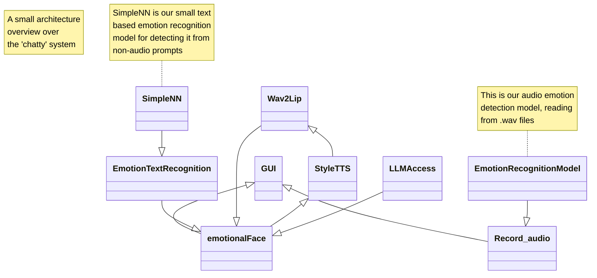

# Chatty - Emotional Chatbot based in Luxembourg

**A project by Albane Keraudren-Riguidel and Henrik Klasen**

## Goal of this project

This project was an assignment in the Natural Language Processing Course at the [University of Luxembourg](www.uni.lu) in the study program "Bachelor in Computer Science".

> The meaning of any communication is the response that you get. If you're not getting theresponse, change what you're doing.

## The system

## Limitations of the System

On a machine with a 20 core processor, as well as a 3060 mobile, this system needs between 30s and 1min for an answer under optimal conditions. Therefore it would be necessary to get all of the generative content, such as speech, as well as video from an external API. However, for this project, we wanted to see how far we would get with just using open-source/open-access projects, such as Googles Gemini, StyleTTS, Wav2Lip and Pytorch.

Models do not recognize non-word content, and throw an error.

## Disclaimer

The Gemini API key will be deactivated after the project. Please insert your own API key in the LLMAccess.py module.